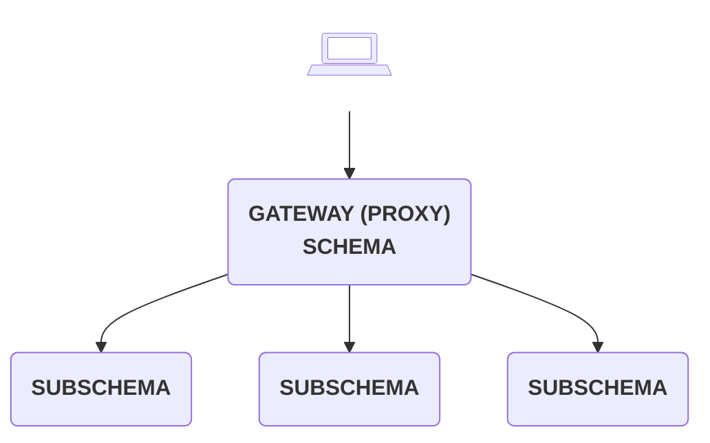

# Introduction

Schema stitching (`@graphql-tools/stitch`) creates a single GraphQL gateway schema from multiple
underlying GraphQL services. Unlike
[schema merging](https://the-guild.dev/graphql/tools/docs/schema-merging), which simply combines
local schema instances, stitching builds a combined proxy layer that delegates requests through to
underlying service APIs. As of GraphQL Tools v7, stitching is fairly comparable to
[Apollo Federation](https://www.apollographql.com/docs/federation/) with automated query planning,
merged types, and declarative schema directives.

Schema stitching uses [schema delegation](/docs/approaches/schema-extensions#schema-delegation)
instead of the regular local schema execution using resolvers.

## Why Stitching?

One of the main benefits of GraphQL is that we can query for all data in a single request to one
schema. As that schema grows though, it may become preferable to break it up into separate modules
or microservices that can be developed independently. We may also want to integrate the schemas we
own with third-party schemas, allowing mashups with external data.

In these cases, `stitchSchemas` is used to combine multiple GraphQL APIs into one unified gateway
proxy schema that knows how to delegate parts of a request to the relevant underlying subschemas.
These subschemas may be local GraphQL instances or APIs running on remote servers.

## How to stitch?

There are three different approaches of stitching your schemas;

- [Schema Extensions](/docs/approaches/schema-extensions)
- [Programmatic Type Merging](/docs/approaches/type-merging)
- [Directive-based Type Merging](/docs/approaches/stitching-directives)

[Learn more about the differences between them](/docs/approaches)
